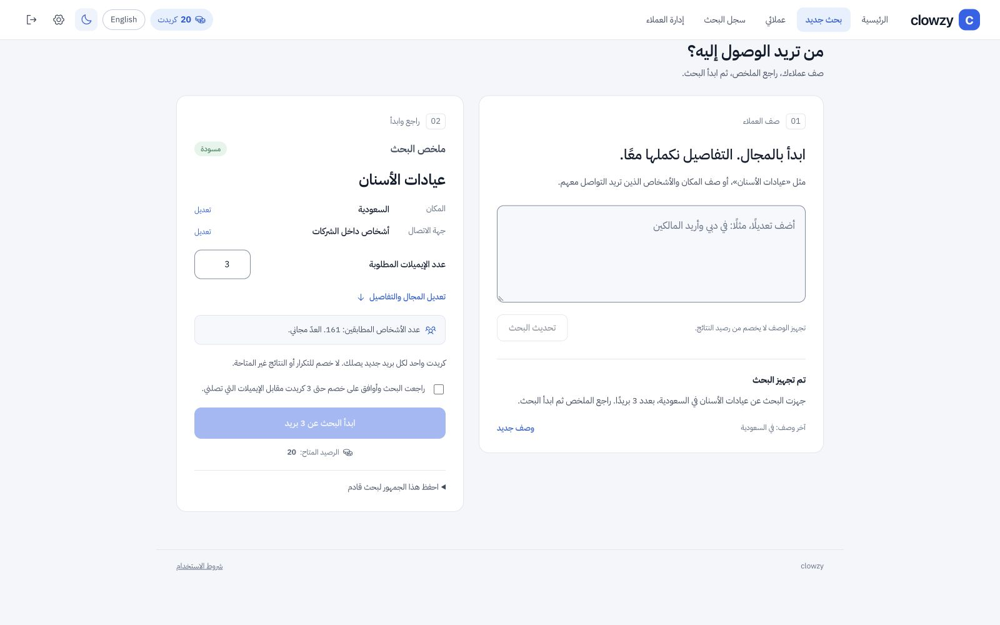

# تنفيذ تجربة البحث — 2 أكتوبر 2026

## ما تغير

- مساحة وصف واضحة، ملخص قابل للتعديل، وعدد ورسوم ظاهرة قبل زر البدء. التفاصيل اليدوية مطوية؛ لا مساعد عائم مكرر في صفحة البحث.
- التخصصات المدرجة تعمل مباشرة دون اتصال بنموذج، مع توحيد الهمزات والتشكيل وصيغ الأسنان الشائعة.
- الوصف المركب يستخدم المساعد الحالي مع سياق النموذج. التعديل يحافظ على الاختيارات غير المذكورة، والرد النهائي يُبنى من القيم التي طُبقت.
- «إعادة الأسنان» يطلب تأكيدًا واحدًا. «أنا طبيب أسنان» يسأل عن جهات الاتصال التجارية. طلب عدد كبير يوضح حد البحث ثم حد الرصيد، ولا يبدأ بحثًا تلقائيًا.
- نتيجة عدّ المطابقات مربوطة بالجمهور الحالي؛ تعديل العدد وحده لا يبطل العدّ. الرد المتأخر لا يكتب فوق تعديل يدوي أحدث.
- البداية بلا مجال مفترض أو عدّ عام مضلل. الفاتح افتراضي مع احترام اختيار داكن محفوظ. لا حزم جديدة.

## أدلة الفحص

- 131 اختبارًا ناجحًا في المجلد الرئيسي، تشمل رحلة API والمحفظة والعزل وCRM. الاختبارات تستخدم بيئة اختبار، وليست دليل بحث مدفوع على الإنتاج.
- فحص الأنواع والتنسيق والبناء ناجح. اختبارات المساعد الثلاثة نجحت أيضًا في نسخة النشر المستقلة.
- اتصال OpenRouter فعلي: «في دبي وأريد المالكين» حافظ على الأسنان وغير المكان والمسمى؛ «محلات العطور» بقي مجالًا مخصصًا؛ «أريد عيادات اسنان في الرياض 3 ايميلات» جهّز السعودية/Riyadh/3.
- الفحص الأول كشف اقتراح مرضى في وصف المهنة وسؤالًا غير لازم عن نوع البحث عند طلب 1000. أضيف مسار صريح للحالتين وأعيد فحصهما؛ لا نعتبر فحص الأمثلة ضمانًا لكل صياغة ممكنة.
- متصفح فعلي بحساب الاختبار: الأسنان طبّقت التخصص وأظهرت 161 شخصًا مطابقًا في السعودية، الرصيد ظل 20. متابعة دبي والمالكين أظهرت تحذير قلة المطابقات. 1000 وضّحت حد 50 وحد الرصيد 20، وزر البدء بقي معطلًا.
- الهاتف: مساحة عرض 390 بكسل، عرض المحتوى 375 بكسل مع شريط التمرير، دون تجاوز أفقي؛ ترتيب عمودي. التصميم يستخدم اتجاهات CSS المنطقية لدعم العربية والإنجليزية.

## نطاق الإصدار

مصدر الإصدار الحي السابق: `dpl_q7c9ZqNatUtmeFtA9zLxAd2YbpZq`. استُخرجت 63 ملفًا عبر [واجهة ملفات النشر الرسمية في Vercel](https://github.com/vercel/sdk/blob/main/docs/sdks/deployments/README.md#getdeploymentfilecontents)، وتحقق SHA-1 لكل ملف. حُفظ المؤلف والالتزام الأصليان. عملية النسخ جعلت رابط origin محليًا في المحاولة الأولى؛ صُحح بعدها إلى رابط GitHub الأصلي قبل إعادة محاولة النشر.

حزمة الإصدار المحددة تتضمن 13 ملفًا: مكونات المساعد/البحث، CSS، الوضع الفاتح، عقد وسياق المساعد، مسار assist فقط، مهلة العميل، وترقية Next من 16.3.6 إلى 16.3.8 المطابقة للنسخة المختبرة. ملفات قاعدة البيانات ومحرّك البحث ومزود العملاء وشروط الاستخدام ونسختها هي ملفات الإصدار الحي نفسها.

لم يُطبق ترحيل `20261002175425_launch_hardening.sql`، ولم تُفعل الجدولة أو إعادة الاستخدام بين الحسابات. نسخة النشر مستقلة عن التعديلات الأوسع غير المنشورة في مجلد العمل.

## حالة النشر

- المحاولة الأولى `dpl_3U2oEGEZHKnw7yASaXDrXD2Ww7yW` نُشرت مؤقتًا؛ كان رابط origin فيها محليًا من عملية النسخ، مع بقاء المؤلف والالتزام الأصليين.
- بعد إصلاح رابط المستودع، المحاولة `dpl_Gzi4KiJity6rRxEtN3zXt7AMwMeW` أصبحت `BLOCKED` مع هوية GitHub الأصلية. السبب المؤكد من Vercel: `TEAM_ACCESS_REQUIRED` / مؤلف الالتزام لا يملك صلاحية إنشاء عمليات نشر لهذا المشروع. لا يجوز استخدام رابط محلي لتجاوز قيد صلاحية المؤلف.
- مراجعة الموافقة التلقائية رفضت الرجوع ابتداءً لأنه يزيل التحديث المنشور. وافق المستخدم صراحة على الرجوع، ثم نجح `vercel rollback`.
- الحالة النهائية المؤكدة: `app.clowzy.io` يشير إلى `dpl_q7c9ZqNatUtmeFtA9zLxAd2YbpZq` / Ready، والواجهة القديمة عادت في المتصفح. التطوير الجديد محلي فقط؛ جلسة حساب الاختبار بقي رصيدها 20 ولم يبدأ أي بحث مدفوع.
- المتبقي قبل إعادة نشر التطوير: تسوية صلاحية مؤلف GitHub الأصلي في مشروع Vercel، ثم نشر نسخة الإصدار المعزولة والتحقق الحي. لا تنشر مجلد العمل الرئيسي بكل تغييرات التقوية قبل ترحيلها المنسق.

## فحوص الواجهة الأخيرة

- تعديل العدد من 10 إلى 3 أبقى 161 مطابقة للأسنان ولم يعلق في حالة العدّ.
- زر البدء لا يتاح قبل المراجعة؛ يتعطل فور كتابة تعديل جديد، دون إرسال طلب بحث.
- الرد الإنجليزي الجديد والملخص وأسماء الحقول ظهرت بالإنجليزية، ثم أعيدت الواجهة إلى العربية والفاتح. اختُبر إرسال التعديل بزر Enter على زر التجهيز.
- فُحص الوضع الداكن بصريًا. لم تُنجز مراجعة شاملة بقارئ شاشة أو إثبات امتثال WCAG، ولم يُنفذ بحث مدفوع جديد.
- آخر تعديل لضبط العدد صفر إلى الحد الأدنى أعقبه نجاح 7 اختبارات مركزة وبناء نسخة الإصدار مجددًا.

