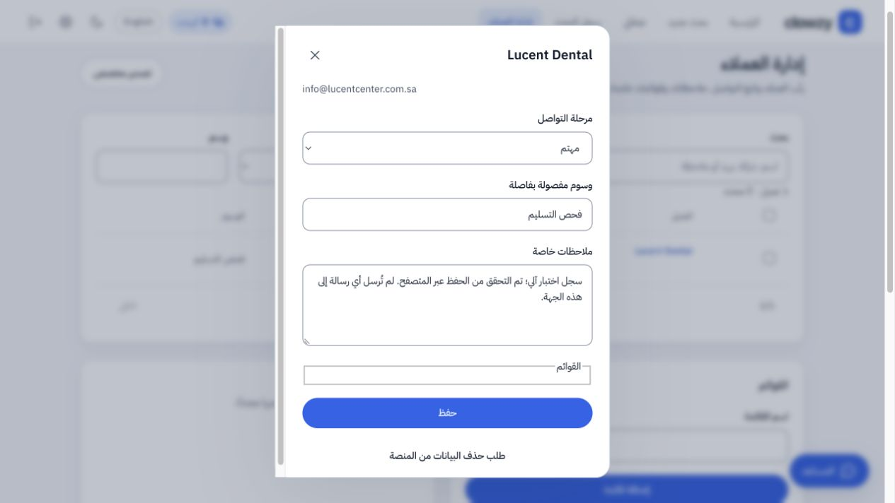

# اختبار التسليم المختصر — 3 أكتوبر 2026

نجح اختبار حي محدود على https://app.clowzy.io بحساب فحص مستقل، من 11:27 إلى 11:28 بتوقيت الجزائر.

| الفحص | النتيجة |
| --- | --- |
| إنشاء حساب فحص والدخول بكلمة المرور | نجح |
| منع المشترك من قراءة بيانات المالك | نجح |
| تجهيز AI لطلب بريد شركة لعيادة أسنان واحدة في الرياض | نجح |
| عدّ الشركات المطابقة قبل البحث | 44؛ هذا عدد الشركات وليس الإيميلات المضمونة |
| بحث حقيقي محدود | طلب 1، وصل 1 |
| حفظ جهة الاتصال وتحديث مرحلتها وملاحظتها في CRM | نجح |
| إشعار اكتمال البحث | موجود |
| تصدير CSV | صف بيانات واحد يحتوي البريد نفسه |
| المحاسبة | خصم 1، الرصيد المتبقي 0، المحجوز 0 |
| إعادة الطلب نفسه | النتيجة نفسها دون سجل أو خصم إضافي |
| إنهاء الفحص | عُطّل حساب الفحص وأُلغيت جلساته؛ أُبقي سجل التدقيق |

لم تتغير كلمات مرور العملاء أو أرصدتهم، ولم تُرسل أي رسالة بريد إلى الجهة المكتشفة. استخدم الاختبار طلب AI واحدًا وطلب بحث واحدًا، وليس محاكاة.

اكتمل أيضًا فحص المتصفح بعد موافقة المستخدم: تسجيل الدخول، فتح نتيجة البحث من اللوحة، تفاصيل العميل، تنزيل ملف CSV فعلي من زر الواجهة (صف واحد و10 أعمدة)، تعديل ملاحظة CRM وحفظها واستمرارها بعد إعادة تحميل الصفحة. نجح التنقل إلى البحث اليدوي ومساعد AI، وبقي بدء بحث جديد ممنوعًا برصيد صفر. لم تسجل أداة المتصفح أخطاء console أثناء الجلسة، ونجح تسجيل الخروج. لم يُشغّل بحث مدفوع ثانٍ.

هذه تجربة أساسية محدودة؛ لا تثبت كل أزرار الواجهة أو سعة الضغط أو ضمان عدد معين لكل مجال ومدينة. إصلاح روابط الصفحة التعريفية الخارجية ما زال يحتاج محررها، وحدود خطة الاستضافة موثقة في تقرير التشغيل.

الأدلة الخاصة محفوظة في `.data/handoff-smoke-proof.json`، وبيانات حساب الفحص المعطّل في ملف منفصل مستبعد من Git والنشر. لم يستلزم الاختبار تغيير كود التطبيق أو نشر إصدار جديد.
