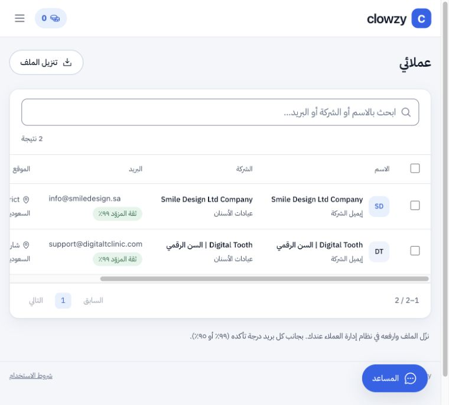

# نتيجة استكمال Clowzy — 2 أكتوبر 2026

الموقع الرسمي: https://app.clowzy.io. البحث اليدوي ومساعد AI منشوران، وحزمة حماية التشغيل وترحيل قاعدة البيانات مطبقان. هذا التقرير يميز الإثبات الحي عن البنود التي تنتظر الوصول إلى حسابات خارجية.

## نشر الإصلاحات وقاعدة البيانات

- نجحت الاختبارات الـ132، وtypecheck وlint وbuild وdiff check.
- النشر الأول للحماية: `dpl_61ZVKjUEXc186gvLnN9ctjaaxcmZ`، بُني دون نقل الدومين أولًا. بعد استعادة النسخة الاحتياطية وتجربة الترحيل، أُوقفت بداية عمليات البحث مؤقتًا بقفل وفحص عدم وجود عمل جارٍ، ثم طُبق الترحيل ورُوّج الإصدار وأُزيل الإيقاف.
- أحدث نشر: `dpl_5M8FXK4rcbh6feYf7bwLJ4FKWFCY` / `clowzy-2jymqszzv-clowzy.vercel.app`، لنفس كود التشغيل مع تثبيت `CATALOG_REUSE_ENABLED=false` صراحة. لم تُسحب بيئة الإنتاج كاملة.
- قاعدة `mcnxefaczqheesoyjibc` أصبحت 27 جدولًا في مخطط `clowzy`. سجل الأرصدة لم يتغير أثناء الترحيل. دور النسخ الاحتياطي يملك القراءة تحت RLS دون BYPASSRLS.
- نسخة قبل الترحيل استُعيدت محليًا وتطابقت أعداد الجداول الـ26. جُرّب الترحيل والاستعادة بدور القراءة محليًا. نسخة إضافية بعد الترحيل استُعيدت وتطابقت أعداد الجداول الـ27.
- عند `22:32 UTC` نجح أيضًا سحب نسخة فعلية بدور الإنتاج `clowzy_backup` نفسه المعدّ لـGitHub، مع التحقق من TLS، واستعادتها محليًا ومطابقة أعداد الصفوف في الجداول الـ27. هذا يثبت صلاحية الدور والنسخة، ولا يثبت تشغيل GitHub Actions.
- ملفات النسخ والأدلة التفصيلية في `.data/backups/` خاصة ومستبعدة من Git والنشر. لا تعيد dump قديمًا فوق معاملات أحدث. إعادة بناء بيئة جديدة تتطلب إعادة الأدوار وصلاحياتها، وإعداد Vault والجدولة من الترحيلات؛ كلمات مرور الأدوار وVault ليست ضمن dump مخطط التطبيق.

## العامل المجدول واختبار المتصفح المغلق

- مهمة Supabase Cron باسم `clowzy-search-worker`، كل دقيقة، ولا تستدعي التطبيق إلا عند وجود بحث جارٍ لحساب فعال. تستخدم نفس العامل الذي يستخدمه المتصفح، بحجز يمنع التنفيذ المتنافس.
- السر في Vault فقط. الوصول إليه مرفوض لأدوار anon وauthenticated وclowzy_app وclowzy_backup. طلب العامل دون السر أعاد 401، وبالسر أعاد 200.
- كشف فحص الحقوق أن طابور pg_net يمنح PUBLIC قراءة لا يستطيع دور postgres إلغاءها. لم تُرسل إليه ترويسة سرية، ولم تُفعّل نسخته الأولى. الترحيل التكميلي يستخدم طلب HTTP مباشرًا محدودًا بـ65 ثانية؛ امتداد pg_net بقي مثبتًا وغير مستخدم بعد رفض حذف الامتداد في فحص الموافقة التلقائي.
- أُغلق تبويب نتائج الفحص في `22:08:50 UTC` والبحث ما زال قيد التحقق. نفذت الجدولة خطواته من 22:09 إلى 22:12، ثم اكتمل من دون صفحة نتائج مفتوحة.
- البحث `d6b26ee0-6c97-4c86-9d1c-6a7b6189f926`: مطلوب 1، وصل 1، خُصم 1، أُفرج عن الحجز. النتيجة بريد الشركة ضمن الإكمال البديل؛ العثور على بريد لشخص بعينه غير مضمون.
- إعادة نفس طلب البحث وإعادة الاستعلام عنه لم تنشئا بحثًا أو عميلًا إضافيًا، ولم تخصما رصيدًا. دفعة المزوّد المؤقتة أُفرغت بعد الإكمال. إشعار CRM موجود.
- حد النسخة الحالية خطوة بحث واحدة في الدقيقة. هذا مناسب للاختبار الأولي؛ لا يمثل إثبات سعة عالية أو ضمان مدة ثابتة لكل بحث.

## الدخول وCRM والتصدير

- حساب QA منفصل موسوم بوضوح، برصيد أولي 2؛ لم نغيّر كلمات مرور العملاء أو نرسل رسائل إليهم.
- واجهات الإنتاج: الدعوة تقبل مرة واحدة، رابط الاستعادة يقبل مرة واحدة، كلمة المرور القديمة والجلسة القديمة تُرفضان بعد الاستعادة، والبحث يُمنع قبل قبول الشروط في حساب الفحص.
- سجّل المتصفح الدخول بالحساب واستخدم البحث اليدوي. حُفظت قائمة CRM ومرحلة «مهتم» ووسم وملاحظة وقائمة مرتبطة بالعميل، وظهرت البيانات بعد إعادة تحميل الحالة.
- تنزيل CSV من المتصفح أنشأ ملفًا فعليًا في Downloads، بصف واحد و10 أعمدة. تصدير GoHighLevel أنشأ ملفًا فعليًا آخر بالبريد والملاحظة الصحيحة، دون إرسال أي شيء إلى CRM خارجي.
- مسار AI: الوصف «أريد بريدًا واحدًا لعيادة أسنان في السعودية، بريد الشركة العام وليس الأشخاص» حوّل الملخص إلى عيادات الأسنان/SA/companies/1، وعدّ 35 شركة مجانًا. حُفظ الجمهور، واكتمل البحث `b3b02aec-b529-4c55-ae88-bd5e5338225d` بنتيجة شركة جديدة مختلفة عن الأولى.
- المحصلة الحية: بحثان مكتملان، عميلان محفوظان، خصم 2 من رصيد الاختبار الأصلي 2، الرصيد النهائي صفر، والحجز صفر. تكرار الطلب لم يخصم مجددًا. محاولة بدء بحث ثالث أعادت 400 ورسالة نفاد الرصيد دون إنشاء بحث جديد. أُعيد التحقق من حفظ ملاحظة CRM والوسم والمرحلة والقائمة والجمهور عبر واجهة الإنتاج.
- سُجل الخروج من حساب الفحص بعد الاختبارات، ثم عُطّل الحساب وأُلغيت جلساته؛ بقيت النتائج وسجل الرصيد للتدقيق. حساب تجربة المستخدم وكلمة مروره لم يتغيرا.

## ما لم يكتمل بعد

1. **GitHub Actions:** ملفات النسخ الليلي، مراقبة التوفر كل ساعة، ومراقبة رصيد Icypeas كل 6 ساعات جاهزة في commit `d7a55f0`. ضُبطت أسرار دور النسخ والمزوّد ومتغير الدومين. رفض GitHub الرفع لأن رمز الأداة لا يحمل workflow. وافق المستخدم على إضافتها، لكن GitHub طلب تحقق البريد؛ لم يكتمل التفويض أو رفع workflows أو تشغيلها. نجاح النسخ المحلية لا يثبت الجدولة. يلزم إكمال تحقق الحساب ثم push وتشغيل المهام وتفقد نسخة أول تشغيل. تفعيل الإشعارات البريدية يعتمد على إعدادات صاحب الحساب.
2. **الصفحة التعريفية clowzy.io:** مبنية على HighLevel/LeadConnector خارج هذا المستودع. الضغط على Log in أظهر «This link hasn’t been set up yet». يلزم وصول المحرر لربط الزر بـhttps://app.clowzy.io/. روابط About/Contact/Privacy/Terms تظهر كـ# أيضًا. الصفحة تعد بتكامل Kelshi مباشر، بينما المثبت في التطبيق تصدير CSV؛ يجب مطابقة هذا الوصف مع المنتج الفعلي قبل التسويق العام. لا تغيّر DNS للدومين الرئيسي لحل زر داخل الصفحة.
3. **قبل الاستخدام التجاري العام:** اختيار خطة استضافة تسمح بالاستخدام التجاري مسؤولية المالك. لم نشترِ خطة أو نغيّر الاشتراك. ترقية Supabase وردت من المستخدم، ولم نتحقق من فاتورتها.

المنصة قابلة لتجربة العميل عبر الرابط المباشر. الإطلاق العام الكامل لا يُعلن قبل حسم البنود أعلاه، ولا يوجد وعد بعدد نتائج مضمون لكل تخصص ومدينة.

## مراجع تنفيذ الجدولة

- https://supabase.com/docs/guides/cron
- https://supabase.com/docs/guides/database/extensions/http
- https://supabase.com/docs/guides/functions/schedule-functions
- https://github.com/pramsey/pgsql-http
